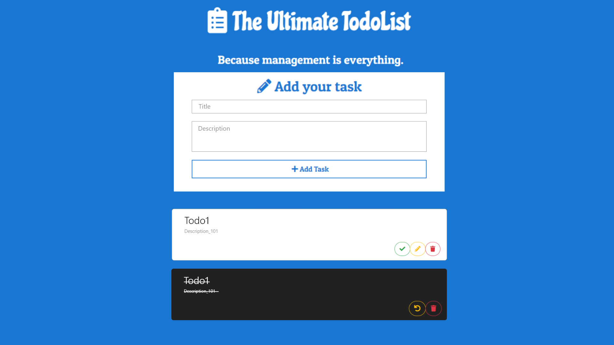

    

<a href="https://www.dropbox.com/s/dg1ugsur6bugybe/The%20Ultimate%20To%20Do%20List%20Project.docx?dl=0" align="center">
<h1 align="center"> ⭐️ Ultimate Todo Application ⭐️ </h1>
</a>

#### To  explore  the  latest  state  of  the  software  development  techniques,  practices,  tools,  and frameworks.

#### This Repository has 8 Different parts

| Part  | Name    | Step-1 | Step-2 | Step-3 | Step-4 | Step-5 |
|-------|--------| :--------:| :--------:| :--------:| :--------:| :--------:|
|   1:  |Server  REST  API’s | Done |  Done | Done | - | - |
|   2:  |Client  Apps | Done |  Done | Done | Done | Done |
|   3:  | Realtime  App |  Done |  - | - | - | - |
|   4:  | Containerizing  the  App  |
|   5:  | Serverless  REST  API |
|   6:  | Cloud  Native  App  |
|   7:  | Advanced  Cloud  Native  App   | 
|   8:  | Fargate  Server  API |

## Team

||||||||
|-- |-- |-- | --| --|-- | --|
 |[Adil Mohsin](https://github.com/adilmohsin) |[Adnan Hussain](https://github.com/Adnan-Hussain22) |[Ikram Khan](https://github.com/ikramkhan9) |[Kashan Adil](https://github.com/Syed-Kashan-Adil) |[Osama Imran](https://github.com/osamaimran25) |[Rehan Sattar](https://github.com/Rehan-Sattar) |[Zayn Korai](https://github.com/zaynkorai)|

## License

The MIT License (MIT)
